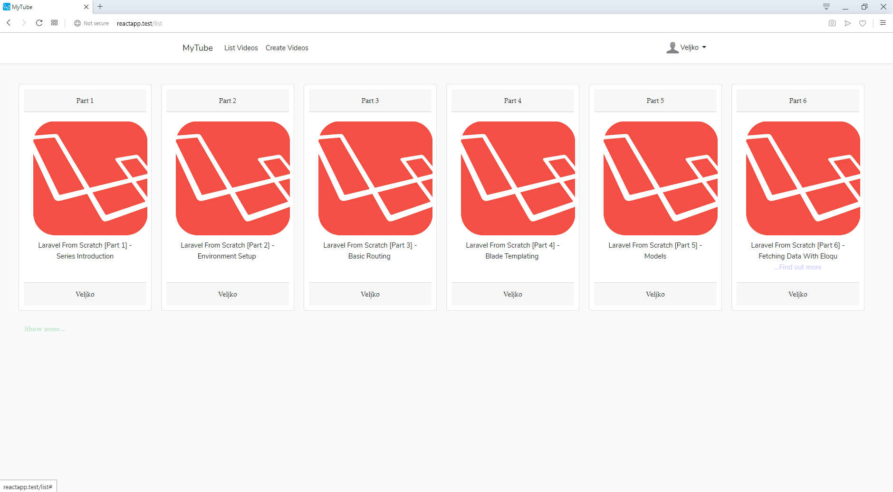

#Video Media Player

##Getting Started
Put this into root of your server. I used xammp, but there is no trouble to make it work with lamp stack.

##Prerequisites
You'll need a xampp installation, composer installed and nmp package manager. 
To disable exploitation and to emulate live conditions go to c:\windows\system32\drivers\etc 
and modify file named hosts. In it add following lines (at the bottom):

1. 127.0.0.1 localhost 
2. 127.0.0.1 reactapp.test
First means it's going to be served locally and second is name of project.

Second(server configuration), go to c:\xampp\apache\conf\extra\ and open httpd-vhosts file.
In it, at the bottom, add these lines:
1. 
```
<VirtualHost *:80>

    DocumentRoot "C:/xampp/htdocs"
    ServerName localhost
    
</VirtualHost>
```
2. and 
```
<VirtualHost *:80>

    DocumentRoot "C:/xampp/htdocs/reactapp/public"
    ServerName reactapp.test
    
</VirtualHost>
```

For instructions for using React in Laravel(alongside with Ajax) use this [resource](https://www.freecodecamp.org/forum/t/how-to-manual-for-react-in-laravel-an-upgrade-with-ajax/314297).

No third party libraries have been used.

##Installing

Install(in tis order):

1. xampp(server environment)
2. composer(Laravel package manger)
3. gitbash(for running terminal)
4. npm(node package manager which can also been used for React and sass)
5. Run xampp, both apache and mysql
6. Create db named `reactapp`
7. In .env file set these variables
```
DB_DATABASE=reactapp
DB_USERNAME=root
DB_PASSWORD=""
```
8. Run migrations
9. Change to gitbash as default terminal
10. In terminal, type: `npm run watch` to compile React and sass files.
11. If you done all correctly, type in browser `reactapp.test`.

##Usage

After starting application, you'll be presented with this image:

Format: 

You either sign in or register if not done so. You may even chose avatar.

After login, you'll see dashboard where you can see your user name, current temperature at your location and upload button which will lead you to upload page. As seen in this image:

Format: 

After login, you're presented to either see the list of all videos or upload yours.
If you choose to upload yours, you'll bee see this image if you chose option to create videos from menu:

Format: 

You must chose title, description and thumbnail for your video.

If you chose to list video, you'll be presented list of six video per page row. If you want to see more of them(if any), click `Show more` text to load more(if any).

Format: 

##Technologies used:

1. React
2. Ajax
3. Laravel
4. Javascript

###My email:
veljkos82@gmail.com


